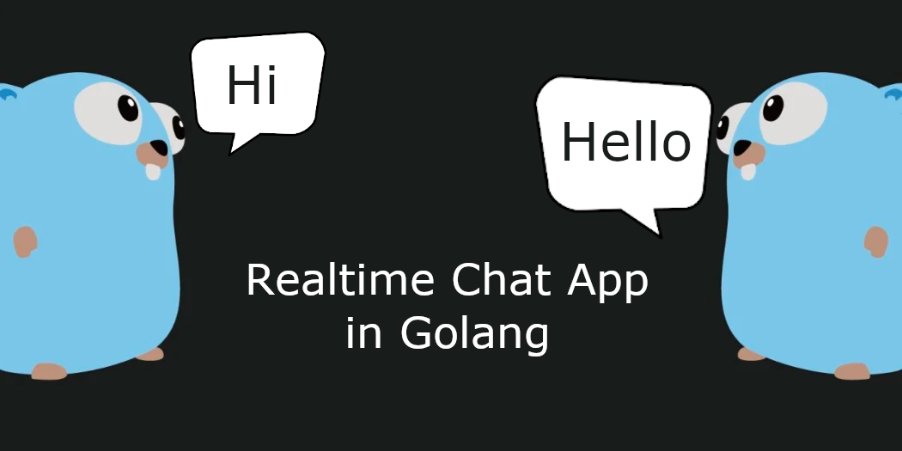

# Chat Application en Go


Cette application est un simple chat en temps réel utilisant Go pour le backend et les websockets pour la communication en temps réel entre les clients.

## Prérequis

- [Go](https://golang.org/dl/) installé sur votre machine.

## Exécutez le serveur :

    ```sh
    go run main.go
    ```
## Fonctionnalités

- Chat en temps réel entre plusieurs clients.
- Affichage des messages avec le nom d'utilisateur.

## Améliorations futures

- Ajouter la gestion des erreurs.
- Ajouter l'authentification des utilisateurs.
- Améliorer l'interface utilisateur.
- Ajouter la persistance des messages.

